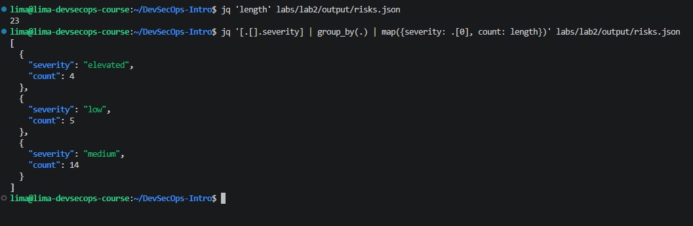
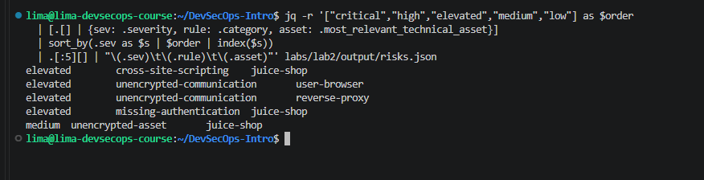
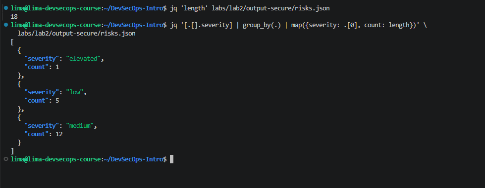
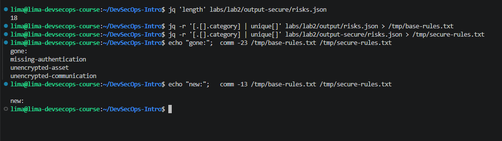

# Lab 2 — Threat Modeling with STRIDE and Threagile

> **Objetivo:** registrar os resultados reais obtidos nas Tasks 1 e 2 e explicar o raciocínio por trás de cada etapa, servindo também como material de estudo.

---

## 1. Visão geral

O Lab 2 usa **Threat Modeling** para analisar a arquitetura do OWASP Juice Shop.

- **STRIDE**: taxonomia para classificar ameaças.
- **Threagile**: ferramenta que lê um modelo de arquitetura em YAML e gera riscos, diagramas e relatórios.

Fluxo conceitual:

```text
Arquitetura
    ↓
Modelo YAML
    ↓
Threagile
    ↓
Regras de risco
    ↓
Riscos + severidades + diagramas
    ↓
Interpretação com STRIDE
```

> O Threagile analisa o que foi **declarado no YAML**. Ele não verifica automaticamente se a aplicação real implementa exatamente aquilo.

---

# 2. Conceitos essenciais

## 2.1 STRIDE

| Letra | Nome | Ideia principal | Pergunta mental |
|---|---|---|---|
| **S** | Spoofing | Falsificação de identidade | Quem é você? Posso confiar nessa identidade? |
| **T** | Tampering | Alteração indevida | Alguém pode alterar esse dado ou conteúdo? |
| **R** | Repudiation | Negação de uma ação | Consigo provar quem fez isso? |
| **I** | Information Disclosure | Exposição de informação | Alguém consegue ver algo que não deveria? |
| **D** | Denial of Service | Indisponibilidade | Alguém consegue impedir o serviço de funcionar? |
| **E** | Elevation of Privilege | Aumento indevido de privilégio | Alguém consegue fazer mais do que deveria? |

Forma curta:

```text
S → identidade
T → integridade
R → rastreabilidade
I → confidencialidade
D → disponibilidade
E → autorização/privilégio
```

---

## 2.2 Technical assets e communication links

No YAML:

```yaml
technical_assets:
```

representa os componentes da arquitetura, por exemplo:

```text
User Browser
Reverse Proxy
Juice Shop Application
Persistent Storage
Webhook Endpoint
```

Já:

```yaml
communication_links:
```

representa as conexões entre esses componentes.

Mentalmente:

```text
technical_assets    = nós
communication_links = setas
target               = destino da seta
```

---

## 2.3 Encryption in transit vs at rest

**In transit**: protege dados enquanto viajam.

```text
Browser ===== HTTPS =====> Application
```

**At rest**: protege dados armazenados.

```text
database
logs
arquivos
volumes
disco
```

---

## 2.4 Authentication vs Authorization

**Authentication** responde:

> Quem é você?

Exemplos:

```text
session-id
token
credentials
client-certificate
```

**Authorization** responde:

> O que você pode fazer?

---

## 2.5 Reverse Proxy

Um reverse proxy fica na frente do backend:

```text
User Browser
      |
      | HTTPS
      v
Reverse Proxy
      |
      | encaminha
      v
Juice Shop
```

Pode cuidar de:

- TLS/HTTPS;
- security headers;
- rate limiting;
- logging;
- roteamento;
- proteção do backend.

No baseline havia:

```text
Browser ===== HTTPS =====> Reverse Proxy ----- HTTP -----> Juice Shop
```

Logo, mesmo com HTTPS até o proxy, o segundo trecho ainda estava em clear text.

---

# 3. Task 1 — Baseline Threat Model

## 3.1 Gerando o baseline

Comando:

```bash
docker run --rm -v "$(pwd)/labs/lab2":/app/work \
  threagile/threagile:0.9.1 \
  -model /app/work/threagile-model.yaml \
  -output /app/work/output
```

Arquivos gerados:

```text
data-asset-diagram.png
data-flow-diagram.png
report.pdf
risks.json
risks.xlsx
stats.json
tags.xlsx
technical-assets.json
```

Os avisos:

```text
Fontconfig error: No writable cache directories
```

não impediram a execução.

---

## 3.2 Total de riscos

Comando:

```bash
jq 'length' labs/lab2/output/risks.json
```

Resultado real:

```text
23
```

Portanto:

> **Baseline total = 23 riscos**

---

## 3.3 Distribuição por severidade

Comando:

```bash
jq '[.[].severity] | group_by(.) | map({severity: .[0], count: length})' \
  labs/lab2/output/risks.json
```

Resultado:

```json
[
  {
    "severity": "elevated",
    "count": 4
  },
  {
    "severity": "low",
    "count": 5
  },
  {
    "severity": "medium",
    "count": 14
  }
]
```

| Severity | Count |
|---|---:|
| Elevated | 4 |
| Medium | 14 |
| Low | 5 |
| **Total** | **23** |

Não houve `critical` nem `high`.

---

## 3.4 Top 5 riscos

Foi usada a ordem:

```text
critical
high
elevated
medium
low
```

Comando:

```bash
jq -r '["critical","high","elevated","medium","low"] as $order
  | [.[] | {sev: .severity, rule: .category, asset: .most_relevant_technical_asset}]
  | sort_by(.sev as $s | $order | index($s))
  | .[:5][] | "\(.sev)\t\(.rule)\t\(.asset)"' \
  labs/lab2/output/risks.json
```

Resultado real:

```text
elevated    cross-site-scripting         juice-shop
elevated    unencrypted-communication    user-browser
elevated    unencrypted-communication    reverse-proxy
elevated    missing-authentication       juice-shop
medium      unencrypted-asset            juice-shop
```

---

## 3.5 Top 5 mapeados para STRIDE

| Severity | Threagile Rule | Asset | STRIDE | Explicação |
|---|---|---|---|---|
| Elevated | `cross-site-scripting` | `juice-shop` | **T — Tampering** | XSS envolve inserir/alterar conteúdo controlado pela aplicação de modo que conteúdo malicioso seja entregue a outros usuários. |
| Elevated | `unencrypted-communication` | `user-browser` | **I — Information Disclosure** | Comunicação HTTP pode expor dados trafegados a quem consiga observar o canal. |
| Elevated | `unencrypted-communication` | `reverse-proxy` | **I — Information Disclosure** | Reverse Proxy → Juice Shop estava em HTTP, sem criptografia. |
| Elevated | `missing-authentication` | `juice-shop` | **S — Spoofing** | O backend não tinha uma forma declarada de verificar a identidade do componente que se conecta a ele nesse link. |
| Medium | `unencrypted-asset` | `juice-shop` | **I — Information Disclosure** | O asset estava declarado com `encryption: none`. |

> A rule do Threagile é específica; STRIDE é uma classificação mais ampla.

---

## 3.6 Trust boundary escolhida

Seta escolhida:

```text
Reverse Proxy
      |
      | HTTP
      v
Juice Shop Application
```

Ela cruza:

```text
Host
  ↓
Container Network
```

Essa seta é particularmente relevante porque aparece associada a dois riscos do top 5:

```text
unencrypted-communication
missing-authentication
```

Além disso, ela chega diretamente à aplicação e transporta dados relacionados a sessão.

### Texto possível para a entrega

> **Reverse Proxy → Juice Shop crosses the Host → Container Network trust boundary. This flow is worth an attacker's time because it reaches the application over an unencrypted channel in the baseline and has no declared authentication between the proxy and the backend, while carrying session-related data.**

---

# 4. Task 2 — Secure Variant and Diff

## 4.1 Objetivo

Criar:

```text
threagile-model-secure.yaml
```

a partir do baseline e medir quais riscos desaparecem.

---

## 4.2 Valores válidos consultados

Encryption:

```text
none
transparent
data-with-symmetric-shared-key
data-with-asymmetric-shared-key
data-with-enduser-individual-key
```

Authentication:

```text
none
credentials
session-id
token
client-certificate
two-factor
externalized
```

Authorization:

```text
none
technical-user
enduser-identity-propagation
```

---

## 4.3 Alterações feitas

### Browser → Juice Shop

Antes:

```yaml
protocol: http
```

Depois:

```yaml
protocol: https
```

---

### Reverse Proxy → Juice Shop

Antes:

```yaml
protocol: http
authentication: none
authorization: none
```

Foi tentado inicialmente:

```yaml
protocol: reverse-proxy-web-protocol-encrypted
```

mas a execução retornou:

```text
unknown 'protocol' of technical asset 'Reverse Proxy'
communication link 'To App':
reverse-proxy-web-protocol-encrypted
```

Então foi usado:

```yaml
protocol: https
authentication: client-certificate
authorization: none
```

Objetivos:

- remover clear text;
- declarar autenticação entre reverse proxy e backend.

`authorization: none` permaneceu porque a Task 2 não pediu alteração desse campo.

---

### Juice Shop Application

Antes:

```yaml
encryption: none
```

Depois:

```yaml
encryption: data-with-symmetric-shared-key
```

---

### Persistent Storage

Antes:

```yaml
encryption: none
```

Depois:

```yaml
encryption: data-with-symmetric-shared-key
```

---

## 4.4 O modelo não altera a aplicação real

Alterar:

```yaml
protocol: https
```

não configura HTTPS de verdade.

Alterar:

```yaml
encryption: data-with-symmetric-shared-key
```

não criptografa automaticamente nenhum arquivo real.

A pergunta da Task 2 é essencialmente:

> Se essa arquitetura segura fosse implementada, quais riscos o modelo deixaria de apontar?

---

## 4.5 Resultado secure

Comando:

```bash
jq 'length' labs/lab2/output-secure/risks.json
```

Resultado:

```text
18
```

Comparação:

```text
Baseline: 23
Secure:   18
```

Riscos removidos:

```text
5
```

Redução:

```text
5 / 23 × 100 ≈ 21.7%
```

---

## 4.6 Distribuição por severidade — Secure

Resultado real:

```json
[
  {
    "severity": "elevated",
    "count": 1
  },
  {
    "severity": "low",
    "count": 5
  },
  {
    "severity": "medium",
    "count": 12
  }
]
```

---

## 4.7 Baseline vs Secure

| Severity | Baseline | Secure | Delta |
|---|---:|---:|---:|
| Elevated | 4 | 1 | **-3** |
| Medium | 14 | 12 | **-2** |
| Low | 5 | 5 | **0** |
| **Total** | **23** | **18** | **-5** |

O hardening reduziu principalmente riscos de maior severidade dentro desse modelo.

---

## 4.8 Rules que desapareceram

Comandos:

```bash
jq -r '[.[].category] | unique[]' \
  labs/lab2/output/risks.json > /tmp/base-rules.txt

jq -r '[.[].category] | unique[]' \
  labs/lab2/output-secure/risks.json > /tmp/secure-rules.txt

echo "gone:"
comm -23 /tmp/base-rules.txt /tmp/secure-rules.txt

echo "new:"
comm -13 /tmp/base-rules.txt /tmp/secure-rules.txt
```

Resultado real:

```text
gone:
missing-authentication
unencrypted-asset
unencrypted-communication

new:
```

Tabela:

| Rule removida | Mudança relacionada |
|---|---|
| `missing-authentication` | Reverse Proxy → Juice Shop: `authentication: none` → `client-certificate` |
| `unencrypted-communication` | links de entrada passaram de `http` para `https` |
| `unencrypted-asset` | Juice Shop e Persistent Storage passaram a ter criptografia em repouso no modelo |

---

## 4.9 Por que 5 riscos sumiram, mas só 3 rules aparecem?

Porque:

```bash
unique[]
```

remove repetições.

Exemplo do baseline:

```text
unencrypted-communication    user-browser
unencrypted-communication    reverse-proxy
```

São dois riscos, mas uma única categoria.

Logo:

```text
5 ocorrências removidas
        ↓
3 categorias inteiras desapareceram
```

---

# 5. Rules que permaneceram

Categorias observadas no modelo secure:

```text
container-baseimage-backdooring
cross-site-request-forgery
cross-site-scripting
missing-authentication-second-factor
missing-build-infrastructure
missing-hardening
missing-identity-store
missing-vault
missing-waf
server-side-request-forgery
unnecessary-data-transfer
unnecessary-technical-asset
```

Duas escolhidas para explicar:

---

## 5.1 `cross-site-scripting`

Permanece porque as alterações feitas foram sobre:

```text
criptografia de comunicação
autenticação entre componentes
criptografia em repouso
```

Nenhuma delas muda como a aplicação processa ou renderiza conteúdo controlado pelo usuário.

```text
HTTPS ≠ proteção contra XSS
```

### Texto possível

> **cross-site-scripting** remains because the hardening changes protect communication and stored data, but they do not change how the application validates or renders user-controlled content.

Na aplicação real, XSS exigiria controles de implementação, como tratamento seguro de entrada/saída e outras medidas apropriadas ao contexto.

---

## 5.2 `server-side-request-forgery`

O modelo possui uma comunicação de saída:

```text
Juice Shop
    |
    | outbound request
    v
Webhook Endpoint
```

Um webhook é uma chamada HTTP automática disparada por um evento para notificar outro sistema.

As mudanças da Task 2 não restringiram esses destinos de saída.

```text
HTTPS na entrada ≠ proteção contra SSRF
```

### Texto possível

> **server-side-request-forgery** remains because the model still allows the Juice Shop application to make outbound requests to an external WebHook, and the hardening changes did not restrict or validate those outbound destinations.

---

# 6. Risco que uma simples mudança no YAML não corrige de verdade

Um bom exemplo é:

```text
cross-site-scripting
```

O YAML pode representar controles melhores, mas editar o threat model não modifica o código da aplicação real.

```text
Threat model
→ descreve e analisa

Implementação
→ precisa realmente aplicar os controles
```

---

# 7. Risco residual

Mesmo após o hardening, continuam riscos ligados à lógica da aplicação, infraestrutura de build, hardening, identidade, secrets e requisições externas.

As mudanças removeram riscos diretamente ligados a:

```text
comunicação sem criptografia
falta de autenticação no link Proxy → App
ausência de criptografia em repouso
```

Mas não eliminaram riscos como XSS ou SSRF.

Logo, o objetivo do hardening não é necessariamente chegar a zero riscos, mas:

```text
identificar
priorizar
mitigar
entender o que permanece
```

---

# 8. Resumo dos resultados reais

## Baseline

```text
Total: 23

Elevated: 4
Medium:  14
Low:      5
```

Top 5:

```text
elevated  cross-site-scripting        juice-shop
elevated  unencrypted-communication   user-browser
elevated  unencrypted-communication   reverse-proxy
elevated  missing-authentication      juice-shop
medium    unencrypted-asset           juice-shop
```

## Secure

```text
Total: 18

Elevated: 1
Medium:  12
Low:      5
```

## Delta

```text
Total:    -5
Elevated: -3
Medium:   -2
Low:       0
```

Rules removidas:

```text
missing-authentication
unencrypted-asset
unencrypted-communication
```

Novas rules:

```text
nenhuma
```

Redução:

```text
≈ 21.7%
```

---

# 9. Checklist

## Task 1

- [x] Total de riscos: **23**
- [x] Tabela por severidade
- [x] Top 5 riscos
- [x] Top 5 mapeados para STRIDE
- [x] Trust boundary escolhida: **Reverse Proxy → Juice Shop**
- [x] Explicação da relevância da seta

## Task 2

- [x] Modelo secure criado
- [x] Links de entrada sem clear text
- [x] Reverse Proxy → App com autenticação declarada
- [x] Juice Shop Application com criptografia em repouso no modelo
- [x] Persistent Storage com criptografia em repouso no modelo
- [x] Total secure: **18**
- [x] Comparação baseline vs secure
- [x] Rules removidas
- [x] Duas rules restantes explicadas
- [x] Risco residual explicado

---

# 10. Evidências

As capturas abaixo correspondem aos resultados reais obtidos durante a execução.

## Task 1 — quantidade e severidades



## Task 1 — Top 5



## Task 2 — severidades secure



## Task 2 — diff


